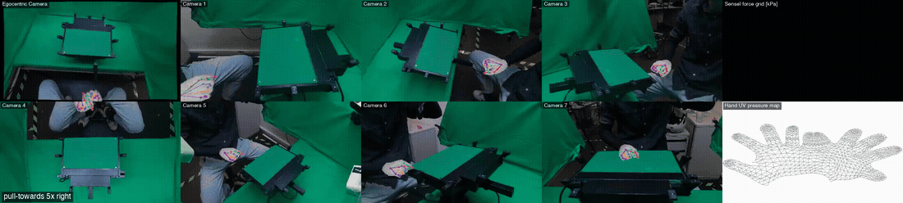

<div align="center">

# EgoPressure: A Dataset for Hand Pressure and Pose Estimation in Egocentric Vision

**CVPR 2025 (Highlight)**

[Yiming Zhao<sup>1*</sup>](https://yiming-zhao.github.io), [Taein Kwon<sup>1*</sup>](https://taeinkwon.com/), [Paul Streli<sup>1*</sup>](https://www.paulstreli.com), [Marc Pollefeys<sup>1,2</sup>](https://people.inf.ethz.ch/marc.pollefeys/), [Christian Holz<sup>1</sup>](https://www.christianholz.net/)<br/>

<sup>1</sup> ETH Zürich
<sup>2</sup> Microsoft<br/>
<sup>*</sup> Equal contribution<br/>

</div>

<p align="center">
<a href="https://siplab.org/projects/EgoPressure"></a>
<a href="https://arxiv.org/abs/2409.02224"></a>
<a href="https://huggingface.co/datasets/eth-siplab/EgoPressure"></a>
</p>

___________

<p align="center">

</p>

21 participants · 32 gestures per hand (1,344 sequences) · 8 synchronized
RGB-D views (1 egocentric + 7 static) · 30 Hz · ≈630K frames per camera view
· RGB, depth, hand masks, MANO hand meshes, and fine-grained touch pressure
for every contact. This repository is the official toolkit for the
[EgoPressure dataset](https://huggingface.co/datasets/eth-siplab/EgoPressure):
download exactly the slice you need, load every modality, visualize frames,
and render sequence videos. Full data reference (modalities & units):
[docs/DATA.md](docs/DATA.md).

🎬 Preview videos: https://drive.google.com/drive/folders/1JUIUvIR2jAV-ghYGtVLgBEN1JdCzkvnE

## Install

Requires Python ≥ 3.9; `ffmpeg` on PATH for video export.

```bash
# pip (any environment: venv, pyenv, system)
pip install "egopressure[all] @ git+https://github.com/eth-siplab/EgoPressure"

# uv
uv pip install "egopressure[all] @ git+https://github.com/eth-siplab/EgoPressure"

# conda / mamba (also installs ffmpeg)
git clone https://github.com/eth-siplab/EgoPressure && cd EgoPressure
conda env create -f environment.yml && conda activate egopressure
```

## Get data

Everything is sharded by participant / sequence / camera / modality —
download only what you need (camera `d` is the egocentric head-mounted view,
`1`–`7` are the static cameras):

```bash
egopressure list
egopressure download --participants p_001 --cameras d --modalities rgb,depth,pressure,pose
```

```python
from egopressure import EgoPressure

ep = EgoPressure.from_hub(participants=["p_001"], cameras=["d"],
                          modalities=["rgb", "depth", "pressure", "pose"])
ep = EgoPressure("egopressure_data")       # or open an existing download
```

Rough sizes for planning: one sequence, all cameras + modalities ≈ 1.5–2.5 GB
(scales with length);
one participant (64 sequences) ≈ 93 GB; ego-camera-only with pressure + pose
≈ 10 GB per participant; the full release is 1.96 TB.

## Explore

[`examples/quickstart.ipynb`](examples/quickstart.ipynb) walks through
everything below with rendered outputs.

```python
seq = ep.sequence("p_001", "p_001_press_palm_low_x5_right")
frame = seq.load_frame(60, depth=True)     # rgb, depth, force, annotation
ann = frame.annotation                     # MANO mesh, joints, ego pose, ...

frame.show(camera="d", overlays=["mesh", "skeleton", "pressure"])
seq.viewer().interact()                    # notebook scrubber
```

`frame.show()` renders the view with the shaded MANO mesh and skeleton
projected through the camera calibration and the measured pressure as a
white glow, plus the force grid and hand-UV pressure map panels (all in
kPa). `modality="depth"` shows depth registered to the color view — same
geometry, overlays included.

The same pressure→image projection is one call if you need it as an array —
the pad lies at `z = 0` in the world frame, so the sensor grid warps through
any camera's calibration:

```python
from egopressure.senselpad import warp_force_to_image, counts_to_kpa

kpa = warp_force_to_image(seq.load_force(60), seq.calibration("4"),
                          image_shape=(1440, 2560))    # kPa per RGB pixel
# ego camera: pass its per-frame pose
kpa = warp_force_to_image(seq.load_force(60), seq.calibration("d"),
                          image_shape=(1080, 1920),
                          extrinsic=ann.ego_extrinsic())
```

## Sequence videos

All cameras tiled — MANO mesh and skeleton overlaid, measured pressure as a
white glow, live sensor panels:

```bash
egopressure video p_001 p_001_press_palm_low_x5_right --out seq.mp4
egopressure video p_001 p_001_press_palm_low_x5_right --modality depth --out depth.mp4
```

Overlays are selectable — any combination of `mesh` (shaded MANO surface by
default; `--mesh-style points` for the vertex cloud), `skeleton` (21-joint,
per-finger colours), and `pressure` (measured force projected into the view
as a white glow). All three are on by default:

```bash
egopressure video p_001 p_001_press_palm_low_x5_right --overlays mesh,skeleton,pressure
egopressure show p_001 p_001_press_palm_low_x5_right 60 --out frame.png   # single frame
```

```python
from egopressure.video import save_video
save_video(seq, "seq.mp4")                          # rgb + overlays + panels
save_video(seq, "depth.mp4", modality="depth")      # depth registered to color
```

Depth tiles are rendered **registered to the color frame** by default so they
are pixel-comparable with the RGB tiles; pass `--depth-view sensor` (or
`depth_view="sensor"`) for the raw 512×512 sensor-frame maps as stored — see
[docs/DATA.md](docs/DATA.md#depth-vs-rgb).

## Geometry in one call

Units and conventions (metres vs millimetres, per-frame ego pose vs fixed
static extrinsics, undistorted pinhole) are handled internally — see
[docs/DATA.md](docs/DATA.md) for the full reference:

```python
from egopressure.registration import register_depth_to_color, world_points_from_depth

cal = seq.calibration("4")                          # static camera 4
uv  = cal.project_world(ann.vertices)               # mesh -> pixels
reg = register_depth_to_color(seq, 60, "d")         # depth -> color frame (mm)
pts = world_points_from_depth(seq, 60, "d")         # depth -> world cloud (m)
```

Raw depth maps are in the **depth-sensor frame** (not pixel-aligned with
RGB) — the two helpers above handle registration and unprojection.

All modalities and configs are demonstrated end-to-end in
[`examples/quickstart.ipynb`](examples/quickstart.ipynb) (rendered with
outputs on GitHub) and [`examples/all_modalities.py`](examples/all_modalities.py).

## Optional: MANO model files

The hand-UV chart on the panels, the shaded mesh surface (the default
hand rendering), and UV-exact pressure-on-surface rendering need the
MANO model files, which MPI licenses separately (free account at
[mano.is.tue.mpg.de](https://mano.is.tue.mpg.de/)). Exactly four files,
placed like this:

```
mano_models/                      # in your working directory (or the repo root,
    MANO_LEFT.pkl                 #  or any folder via $EGOPRESSURE_MANO_PATH)
    MANO_RIGHT.pkl                # from Downloads -> "Models & Code"
    MANO_UV_left.obj              #  (inside the zip: mano_v*/models/)
    MANO_UV_right.obj             # from Downloads -> UV obj files
```

The toolkit detects them automatically. Everything else — loading, download,
viewer, geometry, pressure overlays, videos with the vertex-point hand —
works without them ([`mano_models/README.md`](mano_models/README.md)).

## PyTorch

`EgoPressureFrames` wraps a local download as a standard
`torch.utils.data.Dataset`: one item per `(sequence, frame)` pair, each a
`Frame` with RGB / depth / force / MANO annotation — ready for a `DataLoader`
(shuffling, batching, workers). `annotated_only=True` keeps only frames with a
MANO annotation; pass a `transform` to map frames to tensors for training:

```python
from torch.utils.data import DataLoader
from egopressure.torch_dataset import (EgoPressureFrames, EgoPressureClips,
                                       collate_frames)

data = EgoPressureFrames("egopressure_data", annotated_only=True, cameras=["d"])
frame = data[0]                      # Frame: .rgb, .force, .annotation, ...
loader = DataLoader(data, batch_size=16, num_workers=4,
                    collate_fn=collate_frames)   # or a tensor transform

clips = EgoPressureClips("egopressure_data", window=16, stride=2,
                         annotated_only=True, cameras=["d"])
```

`EgoPressureClips` samples fixed-length temporal windows for sequence models —
clips never cross a sequence boundary or a gap of dropped/unannotated frames.

## Package layout

| Area | Modules |
|---|---|
| Conventions | `constants` (cameras, shapes, units), `layout` (Hub file patterns) |
| Data model | `dataset` (discovery, `Sequence`, `Frame`), `parquet` (shard reader), `annotation` |
| Geometry | `calibration` (project/unproject), `registration` (depth↔color, world clouds), `senselpad` (pad geometry, force→image), `mano` (model loading, vertex reconstruction) |
| Distribution | `hub` (partial download), `cli` |
| Visualization | `viewer` (frame figures), `video` (sequence MP4 export) |
| Integration | `torch_dataset` (`EgoPressureFrames`, `EgoPressureClips`) |
| Facade | `toolkit` (`EgoPressure` entry point) |

## Citation

```bibtex
@InProceedings{Zhao_2025_CVPR,
  author    = {Zhao, Yiming and Kwon, Taein and Streli, Paul and Pollefeys, Marc and Holz, Christian},
  title     = {EgoPressure: A Dataset for Hand Pressure and Pose Estimation in Egocentric Vision},
  booktitle = {Proceedings of the IEEE/CVF Conference on Computer Vision and Pattern Recognition (CVPR)},
  month     = {June},
  year      = {2025},
  pages     = {27727--27738}
}
```

## License

Code: [MIT](LICENSE). Dataset: **CC BY-NC-SA 4.0** (non-commercial,
academic — see the [dataset card](https://huggingface.co/datasets/eth-siplab/EgoPressure)).
MANO files: [MANO license](https://mano.is.tue.mpg.de/license.html).
